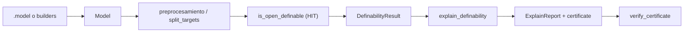

# fopy

**Lógica de primer orden simbólica para Python** — biblioteca estilo SymPy para construir,
transformar, evaluar e imprimir fórmulas FO, estructuras finitas y algoritmos de
**definibilidad abierta** (sin cuantificadores) sobre álgebras finitas.

| | |
|---|---|
| **Versión** | 0.1.0 (alpha) |
| **Python** | ≥ 3.10 |
| **Licencia** | MIT |
| **Dependencias runtime** | ninguna (núcleo puro Python) |
| **Extras** | `[draw]` matplotlib/numpy · `[dev]` pytest/ruff/mypy · `[solvers]` z3 |

---

## Tabla de contenidos

1. [¿Qué es fopy?](#qué-es-fopy)
2. [Instalación](#instalación)
3. [Inicio rápido](#inicio-rápido)
4. [Arquitectura](#arquitectura)
5. [Capa simbólica FO](#capa-simbólica-fo)
6. [Estructuras y semántica](#estructuras-y-semántica)
7. [Constructores de estructuras](#constructores-de-estructuras)
8. [Puente simbólico ↔ finito](#puente-simbólico--finito)
9. [Capa finita: modelos y fórmulas abiertas](#capa-finita-modelos-y-fórmulas-abiertas)
10. [Formato `.model`](#formato-model)
11. [Definibilidad abierta (HIT)](#definibilidad-abierta-hit)
12. [Explicar definibilidad (`explain_definability`)](#explicar-definibilidad-explain_definability)
13. [Certificados verificables](#certificados-verificables)
14. [Model checking y síntesis](#model-checking-y-síntesis)
15. [Álgebra universal finita](#álgebra-universal-finita)
16. [Formas normales](#formas-normales)
17. [Impresión y exportación](#impresión-y-exportación)
18. [Diagramas de Hasse (`draw`)](#diagramas-de-hasse-draw)
19. [Teorías y enumeración de modelos](#teorías-y-enumeración-de-modelos)
20. [Solvers opcionales (Z3)](#solvers-opcionales-z3)
21. [Scripts y CLI](#scripts-y-cli)
22. [Desarrollo y CI](#desarrollo-y-ci)
23. [Layout del repositorio](#layout-del-repositorio)
24. [Decisiones de diseño (ADRs)](#decisiones-de-diseño-adrs)
25. [Limitaciones y alcance](#limitaciones-y-alcance)

---

## ¿Qué es fopy?

`fopy` combina dos mundos que suelen vivir separados en herramientas de lógica:

1. **Capa simbólica** — AST inmutable de términos y fórmulas FO con cuantificadores,
   firmas, estructuras, sustitución, evaluación y LaTeX. Pensada para razonar sobre
   lógica en general (teorías, axiomas, satisfacibilidad en estructuras pequeñas).

2. **Capa finita** — representación tabular de álgebras finitas (`Model`), fórmulas
   **abiertas** (sin cuantificadores) sobre operaciones, y el algoritmo **HIT**
   (Horn Information Tree) con *splitting* de targets para decidir si una relación
   objetivo es **definible sin cuantificadores** a partir de las operaciones.

La funcionalidad distintiva es **`explain_definability`**: no solo responde sí/no, sino que
produce una explicación legible, una fórmula testigo (caso positivo) u obstrucción
(caso negativo), y un **certificado JSON** verificable offline.

```text
  import fopy as fo                    fopy.finite
  ─────────────────                    ────────────
  Signature, symbols                   Model, Relation, Operation
  Formula, Term, ∀∃                    open_formulas (QF)
  Structure + semantics                is_open_definable (HIT)
  builders, theories                   explain_definability ★
  latex, to_nnf, to_prenex             parse_model (.model)
         │                                    │
         └──────── bridge ────────────────────┘
              to_finite_model / from_finite_model
```

---

## Instalación

### Desarrollo local (recomendado)

```bash
git clone <repo>
cd fopy
pip install -e ".[dev,draw]"
```

### Solo núcleo

```bash
pip install -e .
```

`import fopy` funciona **sin** matplotlib ni z3.

### Extras

| Extra | Paquetes | Uso |
|-------|----------|-----|
| `draw` | numpy, matplotlib | diagramas de Hasse, `fopy-draw` |
| `dev` | pytest, ruff, mypy, hypothesis | desarrollo y CI |
| `solvers` | z3-solver | backend SMT opcional |
| `all` | todo lo anterior | entorno completo |

```bash
pip install -e ".[all]"
```

---

## Inicio rápido

### Fórmulas FO simbólicas

```python
import fopy as fo

sig = fo.Signature(functions={"f": 2, "c": 0}, relations={"R": 2, "P": 1})
x, y = fo.symbols("x y")
f, c = sig.function("f"), sig.constant("c")
R, P = sig.relation("R"), sig.relation("P")

phi = fo.forall(x, fo.exists(y, R(f(x, c), y) & P(y)))
print(phi)                    # texto con ∧, ∀, …
print(fo.latex(phi))          # LaTeX
print(fo.free_vars(phi))      # set()
```

### Definibilidad abierta desde un `.model`

```python
from fopy.finite import is_open_definable
from fopy.parse import parse_model

model = parse_model("tests/fixtures/models/minimal.model", preprocess=True)
target = model.targets["T0"]
result = is_open_definable(model, target)

print(result.definable)       # True o False
if result.formula:
    from fopy.finite import format_open_formula
    print(format_open_formula(result.formula))
```

### Explicación + certificado (killer feature)

```python
from fopy.finite import explain_definability, verify_certificate

report = explain_definability(model, "T0")
print(report.pretty())
print(report.proof_sketch())

cert = report.certificate_with_model(model)
assert verify_certificate(cert, model, "T0")
```

```bash
python scripts/demo_explain.py tests/fixtures/models/minimal.model
python scripts/demo_fo.py
```

---

## Arquitectura

`fopy` mantiene **dos AST de fórmulas** a propósito (no fusionados):

| | `fopy.formulas` | `fopy.finite.open_formulas` |
|---|---|---|
| Cuantificadores | sí (`∀`, `∃`) | no (fragmento QF) |
| Átomos | relaciones arbitrarias | solo `eq(t1, t2)` |
| Uso | teorías, semántica general | HIT, `.model`, certificados |
| Impresión | `fo.latex`, `fo.sstr` | `format_open_formula`, `latex_open_formula` |

El flujo típico de investigación en definibilidad:



---

## Capa simbólica FO

### Import

```python
import fopy as fo
# o imports puntuales desde fopy.formulas, fopy.terms, fopy.symbols, …
```

### Firmas y símbolos

```python
sig = fo.Signature(
    functions={"f": 2, "g": 1, "c": 0},
    relations={"R": 2, "P": 1},
)

x, y, z = fo.symbols("x y z")          # Variable(s)
f = sig.function("f")                  # FuncSymbol
c = sig.constant("c")                  # arity 0
R = sig.relation("R")
```

### Términos

```python
t = fo.Apply(f, (x, y))               # f(x, y)
c_term = fo.Constant("c")             # constante como término
```

### Fórmulas

Constructores y conectivos:

```python
# Átomos y igualdad
a = fo.Atom(R, (x, y))
e = fo.eq(x, y)                        # atajo para igualdad

# Conectivos (usar & | ~ o constructores)
psi = fo.Not(a)
chi = a & e                            # And con frozenset interno
rho = a | psi                          # Or
impl = a >> psi                        # implicación como ¬a ∨ ψ
```

Cuantificadores:

```python
phi = fo.forall(x, fo.exists(y, a & fo.eq(x, y)))
# equivalente: fo.ForAll(x, fo.Exists(y, ...))
```

Constantes lógicas: `fo.TrueF()`, `fo.FalseF()`.

### Parser de fórmulas FO

```python
phi = fo.parse_formula(
    "forall x exists y (R(f(x,c), y) & P(y))",
    functions={"f": 2, "c": 0},
    relations={"R": 2, "P": 1},
)
```

Acepta alias Unicode (`∀`, `∃`, `∧`, `∨`, `¬`) y palabras clave en inglés.

### Transformaciones

```python
fo.free_vars(phi)
fo.bound_vars(phi)
fo.substitute(phi, {x: y})            # sustitución de variables libres
fo.rename_bound(phi, {x: z})
fo.simplify(phi)                       # reescrituras locales
```

### Formas normales

```python
nnf = fo.to_nnf(phi)                   # negación normal
prenex = fo.to_prenex(phi)             # forma prenexa
```

---

## Estructuras y semántica

### `Structure`

Estructura finita sobre un universo y una firma:

```python
A = fo.Structure.from_tables(
    sig,
    universe=[0, 1, 2, 3],
    functions={"f": {(0, 1): 2, (1, 0): 3, ...}},
    relations={"leq": {(0, 0), (0, 1), (1, 1), ...}},
)
```

### Evaluación

```python
from fopy.semantics import satisfy, evaluate, extension

# ¿φ es verdadera en A con asignación v?
satisfy(phi, A, {x: 0, y: 1})

# Valor de un término
evaluate(fo.Apply(f, (x, c)), A, {x: 0})

# Extensión de una fórmula abierta (sin cuantificadores)
extension(fo.eq(x, y), A, arity=2)      # set de tuplas donde x=y
```

---

## Constructores de estructuras

Módulo `fopy.builders`:

```python
import fopy as fo

# Catálogo de ejemplos estándar
chain4   = fo.builders.chain(4)                    # cadena 0→1→2→3
B2       = fo.builders.boolean_lattice(2)          # retículo booleano 2^2
diamond  = fo.builders.m3()                        # diamante M₃
pentagon = fo.builders.n5()                        # pentágono N₅
rombo    = fo.builders.retrombo()                  # poset diamante

# Desde relación de cubrimiento (Hasse)
A = fo.builders.from_upper_covers(
    [[1], []],
    names=["0", "1"],
    relation="leq",
)

# Desde tabla de Cayley
G = fo.builders.from_cayley({(0,0):0, (0,1):1, ...}, name="Z2")

# API fluida
sig = fo.Signature(relations={"R": 2})
S = (
    fo.builders.build(sig)
    .universe(0, 1, 2)
    .relation("R", {(0, 1), (1, 2)})
    .name("ejemplo")
    .build()
)
```

Ver [docs/design/003-builders.md](docs/design/003-builders.md).

---

## Puente simbólico ↔ finito

```python
from fopy.bridge import to_finite_model, from_finite_model, load_structure

m = to_finite_model(B2)               # Structure → Model (universo entero)
S2 = from_finite_model(m)             # Model → Structure
m2 = load_structure("archivo.model")  # atajo: parse + opcional conversión
```

Requisito: el universo debe ser (o convertirse a) **enteros** `0..n-1` para la capa finita.

---

## Capa finita: modelos y fórmulas abiertas

### `Model`

```python
from fopy.finite import Model, Relation, Operation

m = Model(
    universe=[0, 1, 2],
    operations={"f": Operation(...)},
    relations={"leq": Relation(...)},
    targets={"T0": Relation(...)},    # relaciones objetivo para definibilidad
)
```

Métodos de conveniencia (delegan en submódulos):

```python
m.models(formula)                      # ¿φ es válida en todo el universo?
m.counterexample(formula)              # asignación que la refuta
m.satisfying_assignments(formula)      # todas las asignaciones satisfactorias
m.term_functions(max_depth=2)          # funciones término por aridad
m.subalgebra_generated_by([0, 1])     # subálgebra generada
print(m.show_tables())                 # volcado textual de tablas
```

### Fórmulas abiertas (`fopy.finite.open_formulas`)

Fragmento cuantificador-libre con igualdad entre términos:

```python
from fopy.finite import Variable, Term, eq, and_formula, or_formula, neg
from fopy.finite.open_parse import parse_open_formula

x = Variable.new("x")
y = Variable.new("y")
vm = {"x": x, "y": y}

f = parse_open_formula(
    "eq(f(x,y),x) & -eq(x,y)",
    vm,
    m.operations,
)

# Evaluación y extensión
f.satisfy(m, {x: 0, y: 1})
f.extension(m, arity=2)               # {(0,1), ...} donde φ vale
```

Dialecto del parser (usado en `.model`):

| Sintaxis | Significado |
|----------|-------------|
| `true`, `false` | ⊤, ⊥ |
| `eq(t1,t2)` | igualdad |
| `-φ` | negación |
| `φ & ψ` | conjunción |
| `φ \| ψ` | disyunción |
| `f(t1,t2)` | operación de la firma |

---

## Formato `.model`

Formato compatible con **OpenDefAlgSplitting** (regresiones en `tests/fixtures/models/`).

### Estructura de un archivo

```text
0 1                          # universo (enteros separados por espacio)

f 2                          # operación: símbolo + aridad
0 0 0                        # filas de la tabla: arg1 arg2 ... resultado
0 1 1
1 0 1
1 1 0

T0 2 1                       # relación: símbolo + #tuplas + aridad
0                            # tuplas en las que T0 vale
1

T1(x,y) eq(f(x,y),x)         # relación definida por fórmula abierta
```

Reglas importantes:

- Usar `eq(x,y)`, **no** `==`.
- Los targets suelen llamarse `T0`, `T1`, …
- Comentarios con `#`.
- Archivos `.model.gz` soportados.

### Cargar y preprocesar

```python
from fopy.parse import parse_model

# preprocess=True (default): aplica split_targets a relaciones T*
model = parse_model("mi_algebra.model", preprocess=True)
target = model.targets["T0"]
```

El preprocesamiento descompone targets complejos en sub-targets más simples
(patrones de tuplas repetidas) antes de ejecutar HIT.

---

## Definibilidad abierta (HIT)

**Pregunta:** dada una álgebra finita con operaciones `{f, g, …}` y una relación
objetivo `T`, ¿existe una fórmula **sin cuantificadores** sobre las operaciones
cuya extensión coincide exactamente con `T`?

```python
from fopy.finite import is_open_definable, DefinabilityResult, HitConfig

result: DefinabilityResult = is_open_definable(model, target)

print(result.definable)
print(result.formula)                  # fopy.finite.open_formulas.Formula | None
print(result.counterexample)           # testigo HIT si no es definible
```

`is_open_definable` es alias de `check_definability`.

### Configuración HIT

```python
from fopy.finite import HitConfig

cfg = HitConfig(
    # parámetros del árbol de información (ver fopy.finite.hit)
)
result = is_open_definable(model, target, cfg)
```

### Algoritmo

1. **Preprocesamiento** del target (`preprocesamiento2` / `split_targets`).
2. **HIT** (`is_open_def`) — búsqueda de fórmula o contraejemplo.
3. Combinación de subfórmulas si el splitting produce varios piezas.

No se usa el enfoque de constelaciones/Minion del proyecto legacy `definability`.
Ver [docs/design/001-hit-definability.md](docs/design/001-hit-definability.md).

---

## Explicar definibilidad (`explain_definability`)

API de alto nivel para investigación y reproducibilidad:

```python
from fopy.finite import explain_definability, ExplainReport

report: ExplainReport = explain_definability(
    model,                    # Model o Structure
    "T0",                     # nombre o Relation
    fragment="qf",            # alias: "open", "quantifier-free"
)

print(report.pretty())        # explicación en inglés
print(report.latex())         # fórmula en LaTeX (si definible)
print(report.proof_sketch())  # esquema de prueba
print(report.counterexample_table())
```

### Caso definible

```text
Relation T0 is definable without quantifiers (qf).

A defining formula is:

    eq(x,x)
```

### Caso no definible

`report.obstruction` contiene un par de tuplas en el **mismo tipo atómico**
(mismas evaluaciones de términos hasta profundidad fija) pero que difieren en el
target — imposible separarlas con ninguna fórmula QF.

```python
from fopy.finite import atomic_type, explain_obstruction

label = atomic_type(model, (0, 1))     # huella de términos
```

Ver [docs/design/004-explain-definability.md](docs/design/004-explain-definability.md).

### Fragmentos soportados

| Fragmento | Alias | Kernel |
|-----------|-------|--------|
| `qf` | `open`, `quantifier-free` | HIT |
| `pp` | positive primitive | k-tipos PP |
| `ep` | existential positive | k-tipos EP |
| `horn` | Horn | k-tipos Horn |
| `fo` | first-order (acotado) | k-tipos FO |

```python
from fopy.finite import Definability

report = Definability.explain(model, "T0", fragment="pp", max_synth_depth=2)
```

Límites de universo y complejidad: [docs/design/007-complexity-bounds.md](docs/design/007-complexity-bounds.md).

---

## Certificados verificables

Certificado JSON ligero para compartir resultados sin re-ejecutar HIT:

```python
from fopy.finite import (
    serialize_certificate,
    deserialize_certificate,
    verify_certificate,
    TrustedKernel,
)

cert = report.certificate_with_model(model)
# {"version": 2, "fragment": "qf", "definable": true/false,
#  "target_sym": "T0", "formula": "...", "witness_tuples": [...],
#  "model_fingerprint": "..."}

blob = serialize_certificate(cert)
loaded = deserialize_certificate(blob)

assert verify_certificate(loaded, model, "T0")
assert TrustedKernel.verify(blob, model, "T0")   # acepta dict o JSON str
```

| Campo | Caso positivo | Caso negativo |
|-------|---------------|---------------|
| `definable` | `true` | `false` |
| `formula` | fórmula QF en dialecto open | `null` |
| `witness_tuples` | opcional | par de tuplas obstructoras |
| `model_fingerprint` | hash de tablas de operaciones | idem |

`verify_certificate` recomputa la extensión de la fórmula o valida el par de
testigos (con fallback a `is_open_definable` si el par no es ideal).

---

## Model checking y síntesis

### Model checking universal

```python
from fopy.finite import models, counterexample, satisfying_assignments

phi = parse_open_formula("eq(x,x)", {"x": x}, m.operations)
assert models(m, phi)                  # ¿válida para toda asignación?
ce = counterexample(m, phi)            # None si válida
assigns = satisfying_assignments(m, phi)
```

### Síntesis de fórmula mínima (post-hoc)

Búsqueda por enumeración de ecuaciones `eq(t1,t2)` hasta `max_depth`:

```python
from fopy.finite import synthesize_defining_formula, SynthesisResult

syn: SynthesisResult = synthesize_defining_formula(m, target, max_depth=3)
print(syn.formula, syn.minimal, syn.min_term_depth)
```

Si la enumeración falla, cae en HIT vía `is_open_definable`.

---

## Álgebra universal finita

Módulo `fopy.universal` — propiedades sobre `Model`:

```python
from fopy.bridge import to_finite_model
from fopy.universal import (
    subalgebra,
    is_subalgebra,
    congruence_lattice,
    homomorphisms,
    is_lattice,
    is_distributive_lattice,
    is_boolean_algebra,
)

m = to_finite_model(fo.builders.boolean_lattice(2))

assert is_lattice(m, "join", "meet")
assert is_distributive_lattice(m, "join", "meet")

subs = subalgebra(m, [1])
latt = congruence_lattice(m)           # lista de Congruence
maps = homomorphisms(m, m)             # solo universos ≤ 6
```

Diagrama del retículo de congruencias (requiere `[draw]`):

```python
from fopy.universal.draw import draw_congruence_lattice
draw_congruence_lattice(m, filename="out/congruence.svg")
```

---

## Formas normales

Sobre el AST simbólico (`fopy.formulas`):

```python
nnf = fo.to_nnf(phi)       # elimina ¬ anidados; De Morgan; cuantificadores
prenex = fo.to_prenex(phi) # mueve cuantificadores al frente
```

---

## Impresión y exportación

### Núcleo

```python
fo.sstr(phi)               # string legible
fo.pprint(phi)             # pretty-print
fo.latex(phi)              # LaTeX
```

### Fórmulas abiertas

```python
from fopy.finite import format_open_formula, latex_open_formula
from fopy.printing.open import sstr as open_sstr, latex as open_latex
```

### Intercambio lógico

```python
from fopy.printing.tptp import to_tptp
from fopy.printing.smtlib import to_smtlib

print(to_tptp(phi, name="conj"))
print(to_smtlib(phi))
```

---

## Diagramas de Hasse (`draw`)

Requiere `pip install -e ".[draw]"`.

### CLI

```bash
python -m fopy.draw
# o
fopy-draw
```

Genera SVG en `out/`: B₂, B₃, cadena, M₃, N₅.

### API

```python
from fopy.draw import draw_lattice, layout_lattice, boolean_lattice, chain

spec = boolean_lattice(2)
draw_lattice(spec, filename="out/B2.svg")

# Desde una Structure con relación de orden
draw_lattice(fo.builders.chain(5), filename="out/chain5.svg")
```

Layout estilo **Freese/LatDraw**: niveles, fuerzas 3D, proyección 2D óptima.
Ver [docs/design/002-hasse-layout.md](docs/design/002-hasse-layout.md).

---

## Teorías y enumeración de modelos

```python
from fopy.theories import Theory

T = Theory(
    sig,
    axioms=[
        fo.forall(x, fo.eq(x, x)),
        # más axiomas…
    ],
)

# Fuerza bruta: modelos de cardinalidad n (solo n ≤ 3, pocas relaciones)
for M in T.models_of_cardinality(2):
    print(M)
```

Útil para experimentos pequeños; no escala.

---

## Solvers opcionales (Z3)

```bash
pip install -e ".[solvers]"
```

```python
from fopy.solvers import check_sat_smt, z3_available

if z3_available():
    result = check_sat_smt(phi)        # experimento SMT-LIB
```

---

## Scripts y CLI

| Comando | Descripción |
|---------|-------------|
| `python scripts/demo_fo.py` | fórmulas FO, builders, definibilidad básica |
| `python scripts/demo_explain.py [archivo.model]` | explain + certificado |
| `python -m fopy.draw` / `fopy-draw` | SVG de ejemplos estándar |
| `pytest tests/ -m finite` | regresión HIT sobre fixtures |
| `pytest tests/ -m draw` | tests de visualización |

---

## Desarrollo y CI

### Comandos locales (equivalente a CI)

```bash
ruff check src tests
ruff format --check src tests    # aplicar: ruff format src tests
mypy src/fopy

# Tests núcleo (cobertura ≥ 85 %)
pytest tests/ -m "not slow and not finite" --cov=fopy --cov-fail-under=85

# Tests capa finita (cobertura ≥ 70 % en fopy.finite)
pytest tests/ -m "finite" --cov=fopy.finite --cov-fail-under=70

# Suite completa habitual (~9 min)
pytest tests/ -m "not slow and not solvers"
```

### Documentación API (autogenerada)

La referencia de API se genera desde los **docstrings** en `src/fopy/` con MkDocs + mkdocstrings. El CI falla si el build no pasa.

```bash
pip install -e ".[docs,draw]"
mkdocs build --strict          # genera site/
mkdocs serve                   # vista previa en http://127.0.0.1:8000
./scripts/build_docs.sh        # atajo
```

- Editar **docstrings** en el código, no duplicar la API en Markdown.
- Reglas: `.cursor/rules/docstrings-manual.mdc`, `.cursor/rules/docs-autogen.mdc`.
- ADRs de diseño: `docs/design/` (incluidos en el sitio).

### Marcadores pytest

| Marcador | Significado |
|----------|-------------|
| `finite` | HIT, `.model`, explain, open formulas |
| `draw` | requiere matplotlib |
| `slow` | tests caros (excluidos en CI rápido) |
| `solvers` | requiere z3 |

### Estilo

- Línea máxima 100, Python 3.10+, `ruff` + `mypy` estricto en `src/fopy`.
- Ver [AGENTS.md](AGENTS.md) para convenciones de agentes/contribución.

---

## Layout del repositorio

```text
fopy/
├── src/fopy/
│   ├── __init__.py          # API pública principal
│   ├── formulas.py          # AST FO con cuantificadores
│   ├── terms.py, symbols.py, signature.py
│   ├── structures.py        # Structure
│   ├── semantics.py         # satisfy, evaluate, extension
│   ├── transform.py         # free_vars, substitute, …
│   ├── normal_forms.py        # to_nnf, to_prenex
│   ├── simplify.py          # reescrituras
│   ├── theories.py          # Theory, enumeración
│   ├── bridge.py            # Structure ↔ Model
│   ├── builders/            # chain, B_n, from_covers, fluent API
│   ├── parse/               # parse_formula, parse_model
│   ├── printing/            # latex, tptp, smtlib, open
│   ├── finite/              # ★ modelos, HIT, explain, certificados
│   │   ├── models.py
│   │   ├── open_formulas.py, open_parse.py
│   │   ├── hit.py           # algoritmo HIT
│   │   ├── definability.py  # is_open_definable
│   │   ├── explain.py       # explain_definability
│   │   ├── certificates.py
│   │   ├── model_checking.py, synthesis.py, algebra.py
│   │   └── preprocessing.py
│   ├── universal/           # subálgebras, congruencias, retículos
│   ├── draw/                # Hasse (opcional)
│   └── solvers/             # z3 (opcional)
├── tests/
│   ├── fixtures/models/     # ~50 archivos .model de regresión
│   └── fixtures/expected/   # golden outputs (explain)
├── docs/design/             # ADRs
├── scripts/                 # demos
├── todo/                    # notas de visión (no backlog v0.1)
├── pyproject.toml
├── AGENTS.md
└── README.md
```

---

## Decisiones de diseño (ADRs)

| ADR | Tema |
|-----|------|
| [001-hit-definability](docs/design/001-hit-definability.md) | HIT + splitting, no Minion |
| [002-hasse-layout](docs/design/002-hasse-layout.md) | layout Freese-style |
| [003-builders](docs/design/003-builders.md) | API de constructores |
| [004-explain-definability](docs/design/004-explain-definability.md) | ExplainReport y certificados |
| [004-substitution](docs/design/004-substitution.md) | sustitución |
| [005-forces](docs/design/005-forces.md) | simulación de fuerzas en draw |
| [006-equality](docs/design/006-equality.md) | igualdad en FO |

---

## Limitaciones y alcance

**v0.1 es alpha.** No publicado en PyPI; instalación editable local.

| Área | Estado |
|------|--------|
| Fragmento QF / open | soportado |
| Cuantificadores en definibilidad | no (solo capa simbólica) |
| Constelaciones / Minion | fuera de alcance |
| `Theory.models_of_cardinality` | n ≤ 3, espacio acotado (funciones + relaciones) |
| `homomorphisms` | universos ≤ 6 |
| Enumeración HIT | puede ser lenta en álgebras grandes |
| PyPI | no disponible aún |

Notas de visión futura en `todo/` (no forman parte del alcance actual salvo petición explícita).

---

## Licencia

MIT — ver encabezado del proyecto y [LICENSE](LICENSE) si aplica.
